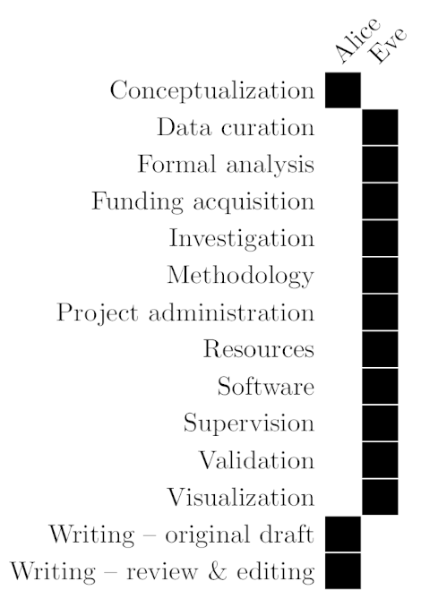
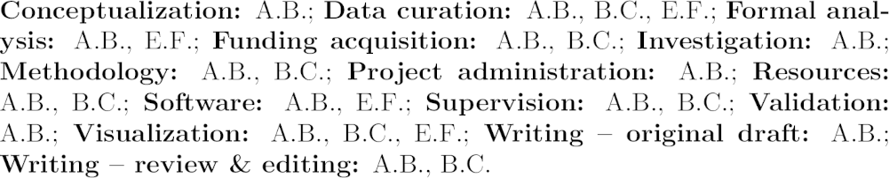

# `latex-credits`: A LaTeX package for generating CRediT (Contributor Role Taxonomy) statements

This is a simple LaTeX package for generating contributor role
statements that can be easily included in a paper. The text of
the roles follows [CRediT](https://credit.niso.org/).

## Installation and Usage

Download [credits.sty](credits.sty) from this repository (or clone the
whole repository) and put it in your project. You may load the package
using `\usepackage{credits}`.

## Defining Authors

Use the `\credit` command to define an author and their contributions to
the paper. The `\credit` command takes two parameters, the first one
being the name of the author, the second one being a comma-separated
list of 14 values, corresponding to the individual roles a contributor
might have. These roles follow the CRediT scheme and are as follows:

1. Conceptualization
2. Data curation
3. Formal analysis
4. Funding acquisition
5. Investigation
6. Methodology
7. Project administration
8. Resources
9. Software
10. Supervision
11. Validation
12. Visualization
13. Writing -- original draft
14. Writing -- review & editing

To define an author that contributed only to the writing and the
conceptualisation, you could use the following command:

```latex
\credit{Alice}{1,0,0,0,0,0,0,0,0,0,0,0,1,1}
```

Suppose you have a second author that did everything *but* the writing
and conceptualisation. You would add such an author using this command:

```latex
\credit{Eve}{0,1,1,1,1,1,1,1,1,1,1,1,0,0}
```

To add a statement about these contributions to the text, use the
`\insertcredits` command. The visualisation will be embedded in
a `tikzpicture` environment so it can be added in-place; it does not
make use of any floats. This is how the statement will look by default:



There is also the option to generate a text statement about
contributors. Just use the `\insertcreditsstatement` command. Here is
how such a statement will be formatted (notice that author names have
been slightly changed):



## Example

The package is readily usable and permits some customisation (this
example can also be found in [example.tex](example.tex)):

```latex
\documentclass{standalone}

\usepackage{xcolor}

\definecolor{cardinal} {RGB}{196, 30, 58}
\definecolor{lightgrey}{RGB}{150,150,150}

% You can configure the colour of the grid and the respective roles of
% individual authors.
\usepackage[role = cardinal, grid = lightgrey]{credits}

% The ordering of the values indicates the ordering of the original
% taxonomy, i.e.:
%
% - Conceptualization
% - Data curation
% - Formal analysis
% - Funding acquisition
% - Investigation
% - Methodology
% - Project administration
% - Resources
% - Software
% - Supervision
% - Validation
% - Visualization
% - Writing -- original draft
% - Writing -- review \& editing
\credit{Alice}  {1,1,1,1,1,1,1,1,1,1,1,1,1,1}
\credit{Bob}    {0,1,0,1,0,1,0,1,0,1,0,1,0,1}

% Values between 0 and 1 will be scaled to be mixed with the background
% colour (white, unless changed by TikZ). This enables giving *partial*
% credit to authors (for instance, if someone helped out initially with
% data curation, but then later went on to another project).
\credit{Charlie}{0,0.5,1,0,0,0,0,0,1,0,0,1,0,0}

\begin{document}
  \insertcredits
\end{document}
```

This results in the following output:


By passing the `horizontal` key when loading the package, you can switch
the ordering of rows and columns, essentially transposing the statement.

```latex
\usepackage[horizontal]{credits}
```

If you are only interested in the textual statement, you can use the
`separator` package option to slightly adjust its formatting.

```latex
% Default: separate individual concepts/roles by a semicolon. This seems
% to be the de facto standard endorsed by many publishers.
\usepackage[separator = {;}]{credits}

% This would create a list of contributions. Personally, I do not like
% this format too much.
\usepackage[separator = {\newline}]credits}
```

Use `\insertcreditsstatement` to place your textual statement anywhere.
Similar to the visual statement, this environment does not create a new
group or float; it can be readily added to *any* text environment. You
can find the full example in [example_text.tex](example_text.tex).

## FAQ

To be more precise, this is a list of *anticipated* questions. No one
actually asked any of these questions.

1. *How can I contribute to this project?*\
   \
   Simple: open an issue or clone the repository and send me a pull
   request. All contributions are welcome!

2. *The LaTeX code is horrible!*\
   \
   Technically, this is not a question. Also: yes, agreed. Consider
   improving it by opening a pull request.

3. *Can you support a certain style or certain feature?*\
   \
   Maybe! Open an issue and let me know what you are interested in.

## License

The package is licensed using a BSD 3-Clause license. See [the license
file](LICENSE.md) for more information.
