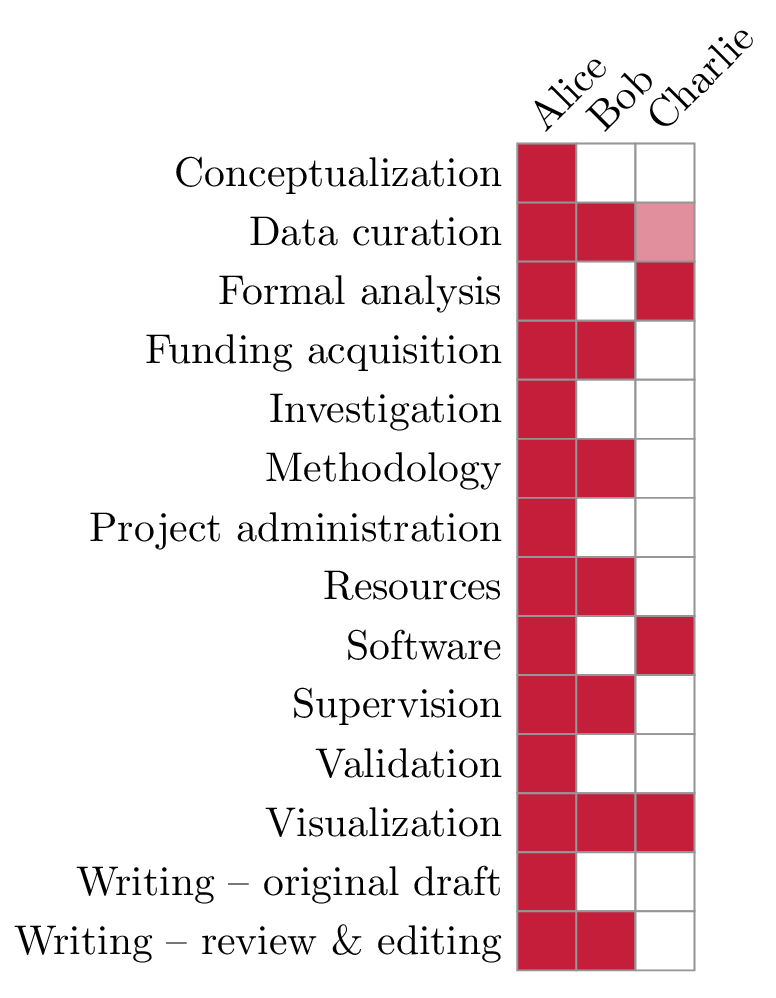

# `latex-credits`: A LaTeX package for generating CRediT (Contributor Role Taxonomy) statements

This is a simple LaTeX package for generating contributor role
statements that can be easily included in a paper. The text of
the roles follows [CRediT](https://credit.niso.org/).

## Example

The package is readily usable and permits some customisation (this
example can also be found in [example.tex](example.tex)):

```latex
\documentclass{standalone}

\usepackage{xcolor}

\definecolor{cardinal} {RGB}{196, 30, 58}
\definecolor{lightgrey}{RGB}{150,150,150}

% You can configure the colour of the grid and the respective roles of
% individual authors.
\usepackage[role = cardinal, grid = lightgrey]{credits}

% The ordering of the values indicates the ordering of the original
% taxonomy, i.e.:
%
% - Conceptualization
% - Data curation
% - Formal analysis
% - Funding acquisition
% - Investigation
% - Methodology
% - Project administration
% - Resources
% - Software
% - Supervision
% - Validation
% - Visualization
% - Writing -- original draft
% - Writing -- review \& editing
\credit{Alice}  {1,1,1,1,1,1,1,1,1,1,1,1,1,1}
\credit{Bob}    {0,1,0,1,0,1,0,1,0,1,0,1,0,1}

% Values between 0 and 1 will be scaled to be mixed with the background
% colour (white, unless changed by TikZ). This enables giving *partial*
% credit to authors (for instance, if someone helped out initially with
% data curation, but then later went on to another project).
\credit{Charlie}{0,0.5,1,0,0,0,0,0,1,0,0,1,0,0}

\begin{document}
  \insertcredits
\end{document}
```

This results in the following output:



## License

The package is licensed using a BSD 3-Clause license. See [the license
file](LICENSE.md) for more information.
